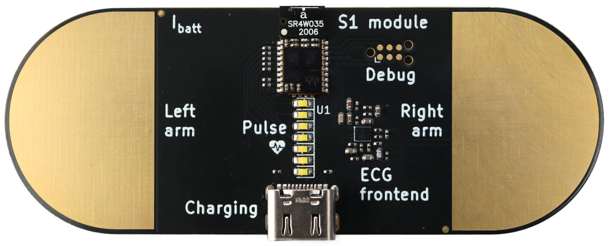
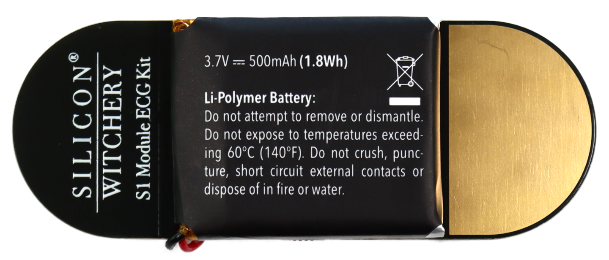

# S1 ECG Demo by Silicon Witchery

Low cost and open-source, the S1 ECG kit is here to make heart research more accessible. The powerful
analog frontend makes this board is an all-in-one kit to deploy and test algorithms with ease. Be that for teaching or research.

**Features:**

- Pre-soldered S1 Module.
- USB-C charging.
- On board battery
- Idle shut-off current 170uA*

 

 

## All in one module
The S1 ECG Board lets you quickly get started with all kinds of ECG based IoT projects. It features our **S1 Module** with:

- **Bluetooth 5.2** based on the Nordic nRF52811.
- **iCE40 FPGA** with 5k LUT & DSP.
- **Battery management** with charging and 3 adjustable voltage rails.
- **32Mb SPI Flash** for storing your FPGA binary and other user data.
- **Single Lead ECG** based on the AD8233 ECG front end
    - Optional 3rd reference electrode
    - Ultra low shutdown current
    - Built in DC/AC leads off detection

 

## Battery & USB

You can use any single lithium polymer cell to power the Popout Board, or power it simply from a 5V USB Type C plug.

Connecting the USB cable will also charge any connected battery. By default, the charge rate is low enough that even small cells can safely be charged, however for larger cells, the charge rate should be configured within firmware.

In time we'll also be supporting USB data so you'll be able to talk to the FPGA over USB.

## Licence

**This design is released under the [Creative Commons Attribution 4.0 International](https://creativecommons.org/licenses/by/4.0/) Licence.**

This is a human-readable summary of (and not a substitute for) the [license](https://creativecommons.org/licenses/by/4.0/legalcode).

### You are free to:

**Share** — copy and redistribute the material in any medium or format

**Adapt** — remix, transform, and build upon the material
for any purpose, even commercially.

The licensor cannot revoke these freedoms as long as you follow the license terms.

### Under the following terms:

**Attribution** — You must give appropriate credit, provide a link to the license, and indicate if changes were made. You may do so in any reasonable manner, but not in any way that suggests the licensor endorses you or your use.

**No additional restrictions** — You may not apply legal terms or technological measures that legally restrict others from doing anything the license permits.

### Notices:

You do not have to comply with the license for elements of the material in the public domain or where your use is permitted by an applicable exception or limitation.

No warranties are given. The license may not give you all of the permissions necessary for your intended use. For example, other rights such as publicity, privacy, or moral rights may limit how you use the material.